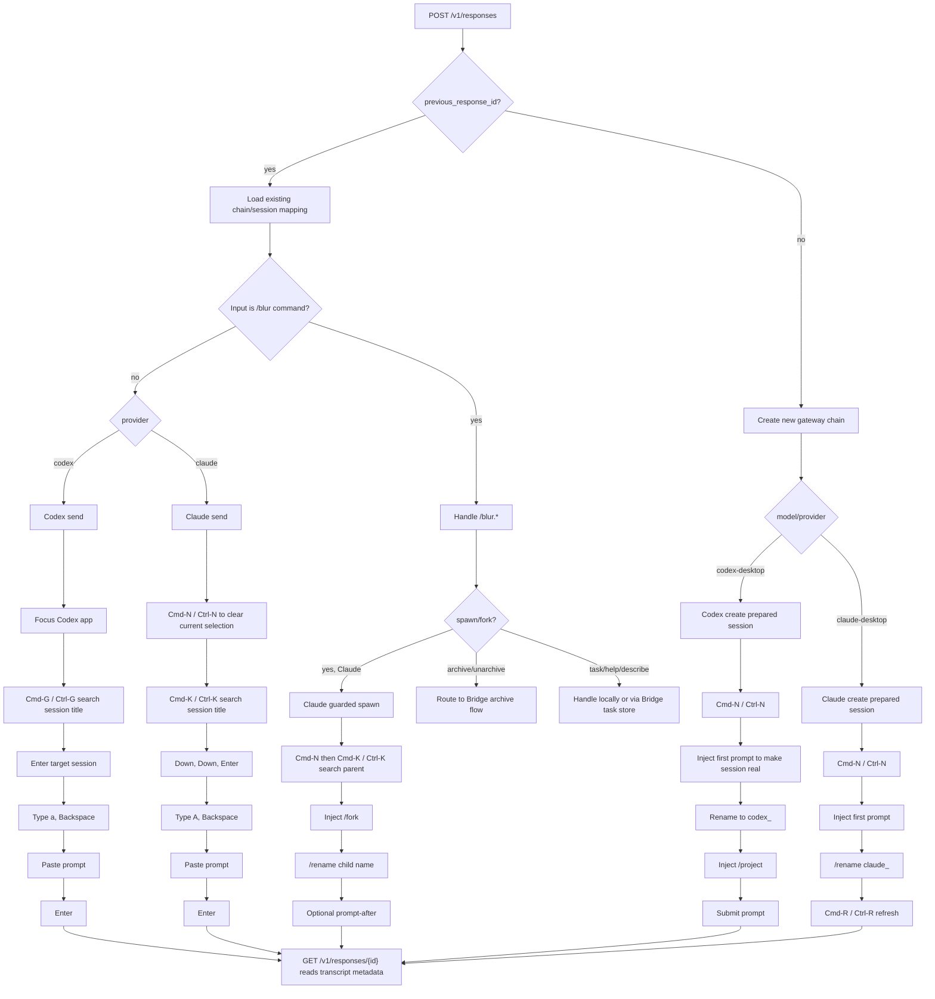

# Desktop Automation Reference

`blur-gateway` routes Responses-style requests to desktop-backed providers. The
gateway owns the session mapping and uses the Bridge shield helpers for guarded
desktop automation.

Core flow:

Quick lookup:

| Function | Codex | Claude |
| --- | --- | --- |
| Create session | `Cmd-N` / `Ctrl-N`, inject first prompt, `Enter`, rename to `codex_<id>`, optionally inject `/project <workspace dir>`, then submit. macOS supports the full prepared-session flow; Windows still needs prepared-session parity work. | `Cmd-N` / `Ctrl-N`, inject first prompt, `Enter`, inject `/rename claude_<id>`, `Enter`, then `Cmd-R` / `Ctrl-R` to refresh metadata. |
| Send to existing session | Focus Codex, `Cmd-G` / `Ctrl-G`, paste session title, `Enter`, click/focus prompt, type `a`, `Backspace`, paste prompt, `Enter`. | `Cmd-N` / `Ctrl-N`, `Cmd-K` / `Ctrl-K`, paste session title, `Down`, `Down`, `Enter`, type `A`, `Backspace`, paste prompt, `Enter`. |
| Rename | During create, use the Codex rename shortcut after the first prompt makes the session real. Existing-session rename can be routed as `/blur.rename <title>`. | Existing-session rename is routed as `/rename <title>`; create-session rename uses the same command and refreshes with `Cmd-R` / `Ctrl-R`. |
| Archive | Route `/blur.archive` to the target Codex session. | Route through the Bridge Claude archive flow using local metadata. |
| Unarchive | Route `/blur.unarchive` to the target Codex session. | Route through the Bridge Claude archive flow using local metadata. |
| Spawn / fork | Not implemented as a dedicated gateway operation yet. | Single guarded shield action: navigate to parent, inject `/fork`, optionally rename child, optionally inject follow-up prompt. |
| Read response | Read Codex local session metadata and transcript files. Screenshots are not required. | Read Claude JSONL metadata and transcript files. Screenshots are not required. |
| Shield behavior | Uses provider-specific HID shield. Blocks interfering user HID input, buffers printable keystrokes, restores prior focus, and replays buffered text. | Uses provider-specific HID shield. Blocks interfering user HID input, buffers printable keystrokes, restores prior focus, and replays buffered text. |

Notes:

- Composite actions should be bundled into one shield request so another desktop
  action cannot interleave mid-flow.
- Claude search does not include the currently selected session, so the send
  path starts with `Cmd-N` / `Ctrl-N` before opening search.
- Codex requires the `a`, `Backspace` prime step before prompt paste.
- Gateway readback should prefer metadata/transcripts over screenshots.
